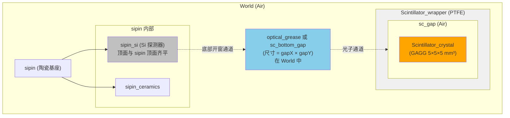
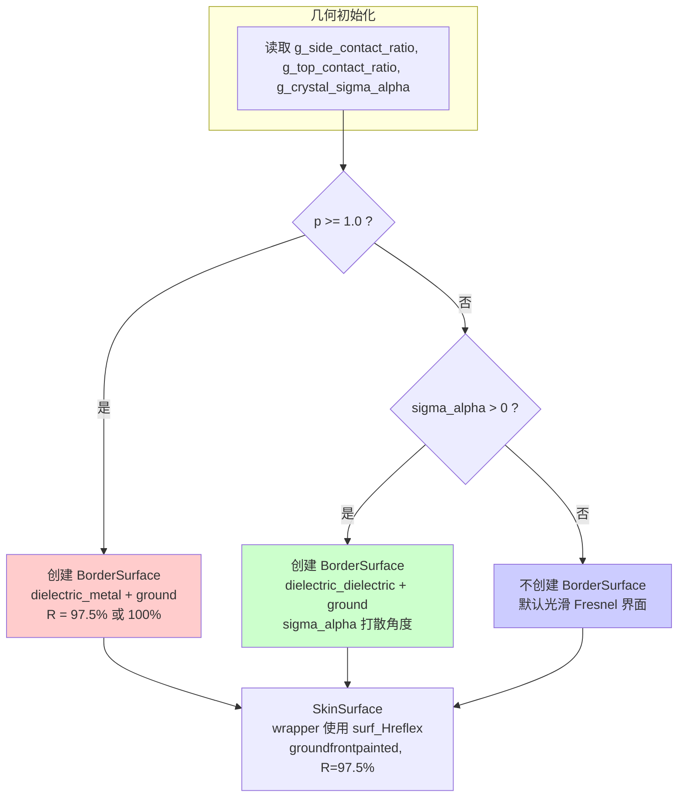
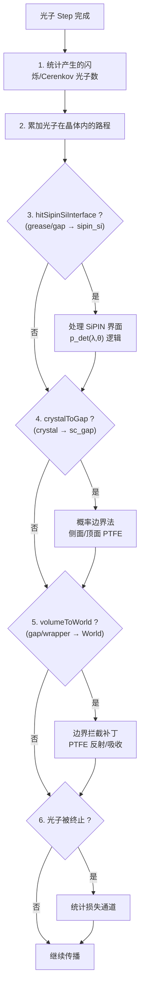
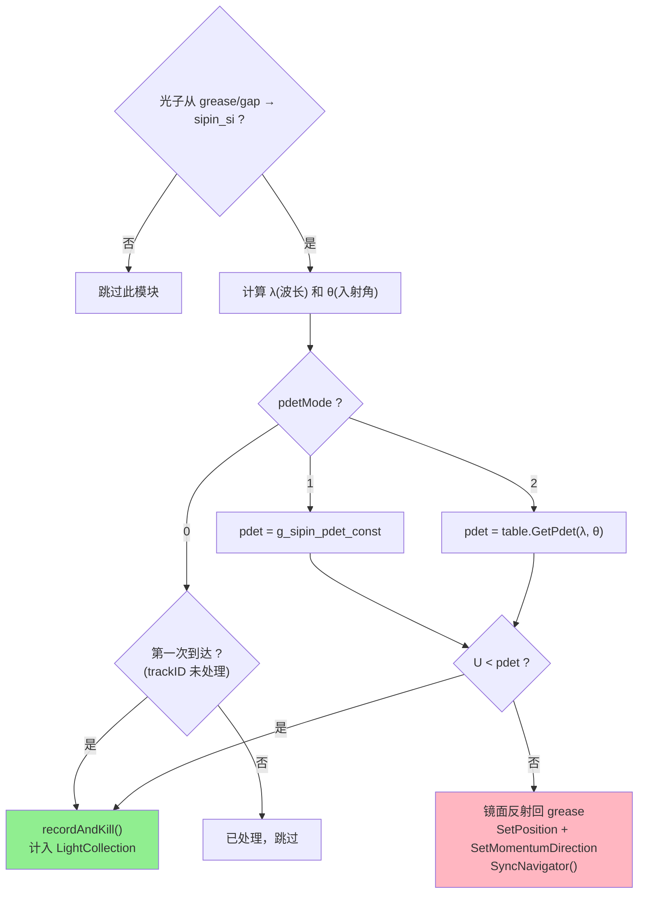

# 代码逻辑详细梳理（供人工检查）

**日期**：2025-12-24  
**文件**：`SiPINLCSteppingAction.cc` 和 `SiPINLCDetectorConstruction.cc`

---

## 第一部分：DetectorConstruction 几何结构

### 1.1 整体层级结构（TEFLON 模式）

```
World (空气)
├── sipin (陶瓷基座)
│   ├── sipin_si (硅探测器，顶面)
│   └── sipin_ceramics (陶瓷，底面)
├── optical_grease 或 sc_bottom_gap (在 World 中，位于 sipin 和 wrapper 之间)
└── Scintillator_wrapper (PTFE 材料)
    └── sc_gap (空气层)
        └── Scintillator_crystal (GAGG 晶体)
```

### 1.2 关键代码：TEFLON 几何构建

```cpp:164-269:src/SiPINLCDetectorConstruction.cc
if (g_wrapper_Type == TEFLON)
{
    // 计算关键尺寸
    const G4double grease_effective = (g_grease_thickness > 10 * um) ? g_grease_thickness : 0.0;
    const G4double sipin_top_z = g_sipin_pos.z() + 0.5 * g_sipin_thickness;
    const G4double bottom_layer_height = (grease_effective > 0) ? grease_effective : g_bottom_airgap_thickness;

    // --- wrapper: 实心盒子 ---
    wrapperX = g_crystalX + 2 * g_gap_thickness + 2 * g_wrapper_thickness;
    wrapperY = g_crystalY + 2 * g_gap_thickness + 2 * g_wrapper_thickness;
    wrapperZ = g_crystalZ + g_top_airgap_thickness + g_wrapper_thickness;
    
    G4double wrapper_bottom_z = sipin_top_z + bottom_layer_height;
    wrapper_pos = G4ThreeVector(0, 0, wrapper_bottom_z + 0.5 * wrapperZ);
    // wrapper 放在 World 中
    MyPhysicalVolume *p_wrapper = new MyPhysicalVolume(0, wrapper_pos, name, l_wrapper, p_world, ...);

    // --- sc_gap: 空气层，在 wrapper 内部 ---
    G4double gapX = g_crystalX + 2 * g_gap_thickness;
    G4double gapY = g_crystalY + 2 * g_gap_thickness;
    G4double gapZ = wrapperZ - g_wrapper_thickness;  // 去掉顶面 wrapper 厚度
    // gap 底面与 wrapper 底面齐平（实现底部开窗）
    G4ThreeVector gap_pos_in_wrapper(0, 0, -0.5 * g_wrapper_thickness);
    // sc_gap 放在 wrapper 中
    MyPhysicalVolume *p_gap = new MyPhysicalVolume(0, gap_pos_in_wrapper, name, l_gap, p_wrapper, ...);

    // PTFE 反射表面（SkinSurface）
    new G4LogicalSkinSurface("WrapperGapSurface", l_wrapper, surf_Hreflex);

    // --- grease 或 bottom_gap 在 World 中 ---
    if (grease_effective > 0.0) {
        // grease 尺寸与 sc_gap 底面相同
        G4Box *s_grease = new G4Box(name, 0.5 * gapX, 0.5 * gapY, 0.5 * grease_effective);
        MyPhysicalVolume *p_grease = new MyPhysicalVolume(0, grease_pos, name, l_grease, p_world, ...);
    } else {
        // 无 grease 时，创建空气层
        MyPhysicalVolume *p_bottom_gap = new MyPhysicalVolume(0, bottom_gap_pos, name, l_bottom_gap, p_world, ...);
    }

    // 晶体在 sc_gap 底部
    crystal_pos = G4ThreeVector(0, 0, -0.5 * gapZ + 0.5 * g_crystalZ);
}
```

**解释**：
1. `wrapper` 是实心 PTFE 盒子，放在 World 中
2. `sc_gap` 是空气层，作为 `wrapper` 的子体积
3. `sc_gap` 底面与 `wrapper` 底面齐平 → **底部开窗**
4. `grease` 或 `sc_bottom_gap` 放在 World 中（不是 wrapper 的子体积）
5. 晶体放在 `sc_gap` 底部

### 1.3 几何结构流程图



### 1.4 表面定义

#### 1.4.1 SkinSurface（作用于 wrapper 的所有表面）

```cpp:220-221:src/SiPINLCDetectorConstruction.cc
// PTFE reflective surface (skin) on wrapper
new G4LogicalSkinSurface("WrapperGapSurface", l_wrapper, surf_Hreflex);
```

**含义**：当光子从任何介质进入 `l_wrapper`（PTFE 材料）时，应用 `surf_Hreflex` 表面。

`surf_Hreflex` 定义（在 `config.hh`）：
```cpp
inline G4OpticalSurface *surf_Hreflex = MyMaterials::surf_Teflon(0.025);
// 2.5% transmittance = 97.5% reflectivity
```

`surf_Teflon` 定义（在 `MyMaterials.cc`）：
```cpp
G4OpticalSurface* MyMaterials::surf_Teflon(double transmittance) {
    G4OpticalSurface* surf_teflon = new G4OpticalSurface("surf_teflon");
    surf_teflon->SetType(dielectric_dielectric);  // 允许 Fresnel/TIR
    surf_teflon->SetFinish(groundfrontpainted);   // 漫反射
    surf_teflon->SetModel(unified);
    // ...设置 REFLECTIVITY = 1 - transmittance
}
```

#### 1.4.2 BorderSurface（晶体表面粗糙度，当 p < 1.0）

```cpp:343-362:src/SiPINLCDetectorConstruction.cc
if (g_crystal_sigma_alpha > 0.0 && !usePtfeContact)
{
    auto* surfCrystal = new G4OpticalSurface("CrystalAir_UNIFIED");
    surfCrystal->SetType(dielectric_dielectric);  // 允许 TIR
    surfCrystal->SetModel(unified);
    surfCrystal->SetFinish(ground);               // 微粗糙
    surfCrystal->SetSigmaAlpha(g_crystal_sigma_alpha);  // 角度偏差（rad）

    // 双向边界表面
    new G4LogicalBorderSurface("CrystalToGapSurface", p_crystal, p_gap, surfCrystal);
    new G4LogicalBorderSurface("GapToCrystalSurface", p_gap, p_crystal, surfCrystal);
}
```

**含义**：
- 当 `sigma_alpha > 0` 时，光子在 crystal ↔ sc_gap 界面会发生"微面法线扰动"
- 这会打散角度，帮助打破 TIR 困光
- `dielectric_dielectric` 类型仍然允许 TIR 发生

#### 1.4.3 BorderSurface（PTFE 贴合模式，当 p ≥ 1.0）

```cpp:385-420:src/SiPINLCDetectorConstruction.cc
if (g_side_contact_ratio >= 1.0 || g_top_contact_ratio >= 1.0)
{
    auto* surfIdealPTFE = new G4OpticalSurface("IdealPTFE_Contact");
    surfIdealPTFE->SetType(dielectric_metal);  // 关键：绕过 TIR！
    surfIdealPTFE->SetModel(unified);
    surfIdealPTFE->SetFinish(ground);          // 朗伯漫反射
    
    // 反射率：p=1.0 → 97.5%，p>1.0 → 100%
    const G4double ptfeR = (g_side_contact_ratio > 1.0 || g_top_contact_ratio > 1.0) ? 1.0 : 0.975;
    
    G4MaterialPropertiesTable* mpt = new G4MaterialPropertiesTable();
    mpt->AddProperty("REFLECTIVITY", photonEnergy, reflectivity, nEntries);
    surfIdealPTFE->SetMaterialPropertiesTable(mpt);

    // 双向边界表面
    new G4LogicalBorderSurface("CrystalToGap_PTFE", p_crystal, p_gap, surfIdealPTFE);
    new G4LogicalBorderSurface("GapToCrystal_PTFE", p_gap, p_crystal, surfIdealPTFE);
}
```

**含义**：
- 使用 `dielectric_metal` 类型，**完全绕过 TIR 物理**
- 光子在 crystal → sc_gap 时，只有反射或吸收，没有 Fresnel 透射/TIR
- `ground` finish 产生真正的朗伯漫反射

### 1.5 表面定义流程图



---

## 第二部分：SteppingAction 逻辑

### 2.1 辅助函数

#### 2.1.1 SyncNavigator（同步导航器）

```cpp:48-60:src/SiPINLCSteppingAction.cc
namespace {
void SyncNavigator(G4Track* track)
{
    auto navigator = G4TransportationManager::GetTransportationManager()
                         ->GetNavigatorForTracking();
    navigator->LocateGlobalPointAndSetup(
        track->GetPosition(),
        nullptr,
        false
    );
}
}
```

**解释**：
- 当我们手动调用 `aTrack->SetPosition(newPos)` 修改光子位置时
- Geant4 的导航器不知道这个变化，会报 `GeomNav1002` 警告
- 调用 `SyncNavigator` 告诉导航器"重新定位"

#### 2.1.2 SampleLambertianHemisphere（朗伯漫反射采样）

```cpp:62-81:src/SiPINLCSteppingAction.cc
G4ThreeVector SampleLambertianHemisphere(const G4ThreeVector& axisUnit)
{
    // r1 -> cos-weighted (朗伯分布)
    const G4double r1 = G4UniformRand();
    const G4double r2 = G4UniformRand();
    const G4double cosTheta = std::sqrt(r1);  // 关键：sqrt(r1) 产生余弦加权
    const G4double sinTheta = std::sqrt(1.0 - r1);
    const G4double phi = 2.0 * CLHEP::pi * r2;

    // 构建局部坐标系
    G4ThreeVector w = axisUnit.unit();        // 法向量
    G4ThreeVector u = w.orthogonal().unit();  // 垂直于 w
    G4ThreeVector v = w.cross(u).unit();      // 第三个轴

    // 合成方向
    G4ThreeVector dir = (sinTheta * std::cos(phi)) * u 
                      + (sinTheta * std::sin(phi)) * v 
                      + (cosTheta) * w;
    return dir.unit();
}
```

**解释**：
- 输入：法向量 `axisUnit`（指向反射方向）
- 输出：在法向量半球内的朗伯分布方向
- `cosTheta = sqrt(r1)` 是余弦加权采样的标准做法

#### 2.1.3 ToLocalPreVolume（全局坐标 → 局部坐标）

```cpp:83-93:src/SiPINLCSteppingAction.cc
G4ThreeVector ToLocalPreVolume(const G4StepPoint* preStepPoint, const G4ThreeVector& globalPoint)
{
    auto touchable = preStepPoint->GetTouchableHandle();
    if (!touchable) return globalPoint;
    const G4AffineTransform transform = touchable->GetHistory()->GetTopTransform();
    return transform.TransformPoint(globalPoint);
}
```

**解释**：
- 把全局坐标点转换为 preStep 所在体积的局部坐标
- 用于精确判断光子在晶体的哪个面

### 2.2 UserSteppingAction 主函数结构



### 2.3 模块 1：统计产生的闪烁/Cerenkov 光子数

```cpp:116-129:src/SiPINLCSteppingAction.cc
// 只在光子第一次出现时统计（CurrentStepNumber == 1）
if (aTrack->GetCurrentStepNumber() == 1)
{
    const G4VProcess* creatorProcess = aTrack->GetCreatorProcess();
    if (creatorProcess && creatorProcess->GetProcessName() == "Scintillation")
    {
        fEventAction->fPhotonGenerated++;
    }
    if (creatorProcess && creatorProcess->GetProcessName() == "Cerenkov")
    {
        fEventAction->fCherenkovGenerated++;
    }
}
```

**解释**：
- `CurrentStepNumber == 1`：光子刚被创建
- 检查创建进程是闪烁还是切伦科夫
- 累加到事件级别计数器

### 2.4 模块 2：累加光子在晶体内的路程

```cpp:142-148:src/SiPINLCSteppingAction.cc
if (preVolumeName == gN_sc_crystal)
{
    G4double stepLength = step->GetStepLength();
    fEventAction->photonPathInCrystal[trackID] += stepLength;
}
```

**解释**：
- 如果光子在晶体内走了一步，累加路程
- 用于理解自吸收效应（路程越长，自吸收越大）

### 2.5 模块 3：SiPIN 界面处理（最重要的探测逻辑）

```cpp:166-337:src/SiPINLCSteppingAction.cc
const G4bool hitSipinSiInterface =
    (postVolumeName == gN_sipin_si) &&
    (preVolumeName == "optical_grease" || preVolumeName == "sc_gap" || preVolumeName == "sc_bottom_gap");

if (hitSipinSiInterface)
{
    // 计算 (λ, θ)
    const G4double wavelength = (1239.841939 * nm) / energy;
    const G4double thetaDeg = std::acos(cosTheta) * 180.0 / CLHEP::pi;

    auto recordAndKill = [&]() {
        // 填充直方图
        // 累加 fLightCollection
        // 标记为已处理
        // kill 光子
    };

    if (g_sipin_pdet_mode == 0)
    {
        // 模式 0：第一次到达 Si 就算"探测到"
        if (fEventAction->processedTrackIDs.find(trackID) == fEventAction->processedTrackIDs.end())
        {
            recordAndKill();
        }
    }
    else
    {
        // 模式 1/2：按 p_det 概率决定
        double pdet = ...;  // 从常数或 CSV 表获取
        
        if (G4UniformRand() < pdet)
        {
            recordAndKill();  // 被探测
        }
        else
        {
            // 镜面反射回 grease
            const G4ThreeVector reflDir = dir - 2.0 * (dir.dot(n)) * n;
            aTrack->SetPosition(backPos);
            SyncNavigator(aTrack);
            aTrack->SetMomentumDirection(reflDir.unit());
            aTrack->SetTrackStatus(fAlive);
        }
    }
}
```

**流程图**：



### 2.6 模块 4：概率边界法（核心逻辑）

```cpp:339-434:src/SiPINLCSteppingAction.cc
const G4bool crystalToGap = (preVolumeName == gN_sc_crystal) && 
                             (postVolumeName == "sc_gap");

if (crystalToGap && (g_side_contact_ratio > 0.0 || g_top_contact_ratio > 0.0))
{
    // === 关键：用晶体局部坐标判别"跨的是哪一个面" ===
    const G4ThreeVector preLocal = ToLocalPreVolume(preStepPoint, prePos);
    const G4double halfX = 0.5 * g_crystalX;
    const G4double halfY = 0.5 * g_crystalY;
    const G4double halfZ = 0.5 * g_crystalZ;

    // 面判据（用 surface tolerance 做容差）
    const G4double tol = G4GeometryTolerance::GetInstance()->GetSurfaceTolerance();
    const G4bool onPosX = std::abs(preLocal.x() - (+halfX)) < 50.0 * tol;
    const G4bool onNegX = std::abs(preLocal.x() - (-halfX)) < 50.0 * tol;
    const G4bool onPosY = std::abs(preLocal.y() - (+halfY)) < 50.0 * tol;
    const G4bool onNegY = std::abs(preLocal.y() - (-halfY)) < 50.0 * tol;
    const G4bool onNegZ = std::abs(preLocal.z() - (-halfZ)) < 50.0 * tol;

    const G4bool isSide = (onPosX || onNegX || onPosY || onNegY);
    const G4bool isBottom = onNegZ;
    
    if (!isBottom)  // 底面不处理（留给 grease/sipin 通道）
    {
        G4double p = isSide ? g_side_contact_ratio : g_top_contact_ratio;
        
        if (p > 0.0)
        {
            G4bool hitPTFE = (p >= 1.0) ? true : (G4UniformRand() < p);
            
            if (hitPTFE)
            {
                G4double R = g_ptfe_reflectivity;  // 0.975
                G4double randR = G4UniformRand();
                
                if (randR >= R)
                {
                    // 被 PTFE 吸收（2.5%）
                    aTrack->SetTrackStatus(fStopAndKill);
                    fEventAction->fEscapePTFE++;
                    return;
                }
                else
                {
                    // PTFE 漫反射（97.5%）
                    G4ThreeVector normal = ...;  // 根据面判据确定
                    G4ThreeVector newDir = SampleLambertianHemisphere(normal);
                    aTrack->SetMomentumDirection(newDir);
                    
                    // 把光子推回晶体内
                    G4ThreeVector newPos = prePos + normal * 0.1 * um;
                    aTrack->SetPosition(newPos);
                    SyncNavigator(aTrack);
                    aTrack->SetTrackStatus(fAlive);
                }
            }
            // hitPTFE == false：遇到空气层，让光子继续自然传播
        }
    }
}
```

**流程图**：

```mermaid
flowchart TD
    A{"光子从 crystal → sc_gap ?"}
    
    A -->|否| Skip["跳过此模块"]
    A -->|是| B["转换到晶体局部坐标<br/>preLocal = ToLocalPreVolume(prePos)"]
    
    B --> C["判别是哪个面<br/>onPosX? onNegX? onPosY? onNegY? onNegZ?"]
    
    C --> D{"isBottom ?<br/>(onNegZ)"}
    
    D -->|是| E["底面：不处理<br/>让光子继续到 grease/sipin"]
    D -->|否| F["p = isSide ? side_contact_ratio : top_contact_ratio"]
    
    F --> G{"p > 0 ?"}
    
    G -->|否| H["p = 0：让 Geant4 处理 TIR/透射"]
    G -->|是| I{"p >= 1.0 ?<br/>或 U < p ?"}
    
    I -->|否 (1-p 概率)| J["遇到空气层<br/>让光子继续自然传播到 wrapper"]
    I -->|是 (p 概率)| K{"U >= R ?<br/>(R = 0.975)"}
    
    K -->|是 (2.5%)| L["被 PTFE 吸收<br/>fEscapePTFE++<br/>kill"]
    K -->|否 (97.5%)| M["PTFE 漫反射<br/>newDir = SampleLambertianHemisphere(normal)<br/>newPos = prePos + normal * 0.1um<br/>SetPosition + SyncNavigator"]
    
    style L fill:#FF6347
    style M fill:#90EE90
    style E fill:#87CEEB
```

### 2.7 模块 5：边界拦截补丁

```cpp:436-498:src/SiPINLCSteppingAction.cc
// 当光子从 sc_gap/wrapper 进入 World 时
// 关键修正：不要把"底部开窗"也当成 PTFE 反射/吸收

const G4bool postIsWorld = (postVolumeName == "World");
const G4bool preIsWrapper = (preVolumeName == gN_sc_wrapper);
const G4bool preIsGap = (preVolumeName == "sc_gap");

// 计算 wrapper 底面 z 坐标
const G4double sipin_top_z = g_sipin_pos.z() + 0.5 * g_sipin_thickness;
const G4double grease_effective = (g_grease_thickness > 10 * um) ? g_grease_thickness : 0.0;
const G4double bottom_layer_height = (grease_effective > 0.0) ? grease_effective : g_bottom_airgap_thickness;
const G4double wrapper_bottom_z = sipin_top_z + bottom_layer_height;

const G4double zPost = postStepPoint->GetPosition().z();
const G4bool isBottomOpeningCrossing = (zPost <= wrapper_bottom_z + 50.0 * tolWorld);

// 只拦截：wrapper→World，或者 sc_gap→World 但不是底部开窗
const G4bool volumeToWorld =
    postIsWorld &&
    (preIsWrapper || (preIsGap && !isBottomOpeningCrossing));
    
if (volumeToWorld)
{
    G4double R = g_ptfe_reflectivity;
    G4double randR = G4UniformRand();
    
    if (randR >= R)
    {
        // 被 PTFE 吸收
        aTrack->SetTrackStatus(fStopAndKill);
        fEventAction->fEscapePTFE++;
        return;
    }
    else
    {
        // PTFE 漫反射
        // ...判断是哪个面，计算 normal...
        G4ThreeVector newDir = SampleLambertianHemisphere(normal);
        G4ThreeVector newPos = preStepPoint->GetPosition() + normal * 0.1 * um;
        aTrack->SetPosition(newPos);
        SyncNavigator(aTrack);
        aTrack->SetMomentumDirection(newDir);
        aTrack->SetTrackStatus(fAlive);
    }
}
```

**流程图**：

```mermaid
flowchart TD
    A{"postVolume == World ?"}
    
    A -->|否| Skip["跳过此模块"]
    A -->|是| B{"preVolume == wrapper ?"}
    
    B -->|是| C["wrapper → World<br/>这是 wrapper 外表面漏光"]
    B -->|否| D{"preVolume == sc_gap ?"}
    
    D -->|否| Skip
    D -->|是| E{"zPost <= wrapper_bottom_z ?<br/>(底部开窗区域)"}
    
    E -->|是| F["底部开窗通道<br/>这是正常物理路径<br/>不拦截！"]
    E -->|否| G["sc_gap → World (侧/顶方向)<br/>这是漏光，应拦截"]
    
    C --> H{"U >= R ?"}
    G --> H
    
    H -->|是 (2.5%)| I["被 PTFE 吸收<br/>fEscapePTFE++"]
    H -->|否 (97.5%)| J["PTFE 漫反射<br/>推回 sc_gap 内"]
    
    style F fill:#90EE90
    style I fill:#FF6347
```

### 2.8 模块 6：损失通道统计

```cpp:500-639:src/SiPINLCSteppingAction.cc
if (aTrack->GetTrackStatus() == fStopAndKill || 
    aTrack->GetTrackStatus() == fKillTrackAndSecondaries)
{
    // 跳过已经被统计为"成功探测"的光子
    if (fEventAction->processedTrackIDs.find(trackID) != fEventAction->processedTrackIDs.end())
        return;
    
    // 根据终止位置和进程分类
    if (preVolumeName == gN_sc_crystal)
    {
        if (procName == "OpAbsorption")
            fEventAction->fEscapeAbsorbed++;     // 晶体自吸收
        else if (postVolumeName == "sc_gap" || postVolumeName == gN_sc_wrapper)
            fEventAction->fEscapePTFE++;         // BorderSurface 吸收
    }
    else if (preVolumeName == gN_sc_wrapper)
    {
        fEventAction->fEscapePTFE++;             // wrapper 内吸收
    }
    else if (preVolumeName == "sc_gap")
    {
        if (postVolumeName == gN_sc_wrapper)
            fEventAction->fEscapePTFE++;         // SkinSurface 吸收
        else
            fEventAction->fEscapeSideAir++;      // gap 内终止
    }
    else if (postVolumeName == "OutOfWorld")
    {
        if (preVolumeName == "optical_grease" || preVolumeName == "sc_bottom_gap")
            fEventAction->fEscapeGrease++;       // 从 grease 边缘逃出
        else if (preVolumeName == gN_sc_wrapper || preVolumeName == "sc_gap")
            fEventAction->fEscapePTFE++;         // 从 wrapper 区域逃出
        else
            fEventAction->fEscapeWorld++;        // 其他（不应发生）
    }
    else if (preVolumeName == "optical_grease" || preVolumeName == "sc_bottom_gap")
    {
        fEventAction->fEscapeGrease++;           // grease 内吸收
    }
    // ...其他情况
}
```

**损失通道分类表**：

| 计数器 | 含义 | 触发条件 |
|--------|------|---------|
| `fEscapeAbsorbed` | 晶体自吸收 | preVolume=crystal, process=OpAbsorption |
| `fEscapePTFE` | PTFE 吸收 | 概率边界吸收、BorderSurface 吸收、SkinSurface 吸收、wrapper 区域逃出 |
| `fEscapeSideAir` | 侧向空气逃逸 | preVolume=sc_gap 且 postVolume 不是 wrapper |
| `fEscapeGrease` | grease 吸收/边缘逃逸 | preVolume=grease/sc_bottom_gap 或从这些体积逃出 World |
| `fEscapeWorld` | World 边界逃出 | 其他未分类的 OutOfWorld |

---

## 第三部分：完整流程总图

```mermaid
flowchart TD
    subgraph Geometry["几何构建 (DetectorConstruction)"]
        G1["World → wrapper → sc_gap → crystal"]
        G2["grease/sc_bottom_gap 在 World 中"]
        G3["SkinSurface: wrapper 使用 surf_Hreflex"]
        G4{"p >= 1.0 ?"}
        G4 -->|是| G5["BorderSurface: dielectric_metal"]
        G4 -->|否| G6{"sigma > 0 ?"}
        G6 -->|是| G7["BorderSurface: dielectric_dielectric + sigma_alpha"]
        G6 -->|否| G8["默认光滑界面"]
    end
    
    subgraph Stepping["每一步 (SteppingAction)"]
        S1["光子从 crystal → sc_gap"]
        S1 --> S2{"是底面 ?"}
        S2 -->|是| S3["继续到 grease → Si"]
        S2 -->|否| S4{"p > 0 ?"}
        S4 -->|是| S5{"U < p ?"}
        S5 -->|是 (贴合)| S6{"U < R ?"}
        S6 -->|是| S7["PTFE 漫反射回晶体"]
        S6 -->|否| S8["PTFE 吸收"]
        S5 -->|否 (不贴合)| S9["Geant4 处理 TIR/透射"]
        S4 -->|否| S9
        
        S3 --> S10{"到达 Si ?"}
        S10 -->|是| S11{"pdetMode=0 或 U < pdet ?"}
        S11 -->|是| S12["计入 LightCollection ✓"]
        S11 -->|否| S13["镜面反射回 grease"]
    end
    
    style S12 fill:#90EE90
    style S8 fill:#FF6347
```

---

## 第四部分：关键参数对照表

| 参数名 | 含义 | 在几何中的作用 | 在 SteppingAction 中的作用 |
|--------|------|---------------|---------------------------|
| `g_side_contact_ratio` | 侧面贴合比例 p | p≥1.0 时创建 dielectric_metal BorderSurface | 0<p<1 时按概率决定 PTFE 还是 air |
| `g_top_contact_ratio` | 顶面贴合比例 p | 同上 | 同上 |
| `g_crystal_sigma_alpha` | 晶体表面粗糙度 | p<1.0 时创建 dielectric_dielectric BorderSurface | 不直接使用（由 Geant4 处理） |
| `g_ptfe_reflectivity` | PTFE 反射率 R | 用于 p≥1.0 时的 BorderSurface | 用于概率边界法和边界拦截 |
| `g_sipin_pdet_mode` | 探测模式 | 不使用 | 0=hit即计，1=常数pdet，2=查表 |
| `g_gap_thickness` | 侧面空气层厚度 | 决定 sc_gap 尺寸 | 用于边界拦截的面判据 |

---

这份文档完整梳理了两个核心文件的逻辑。如果你发现任何可疑之处，请告诉我具体行号或分支，我会进一步解释或修正。

